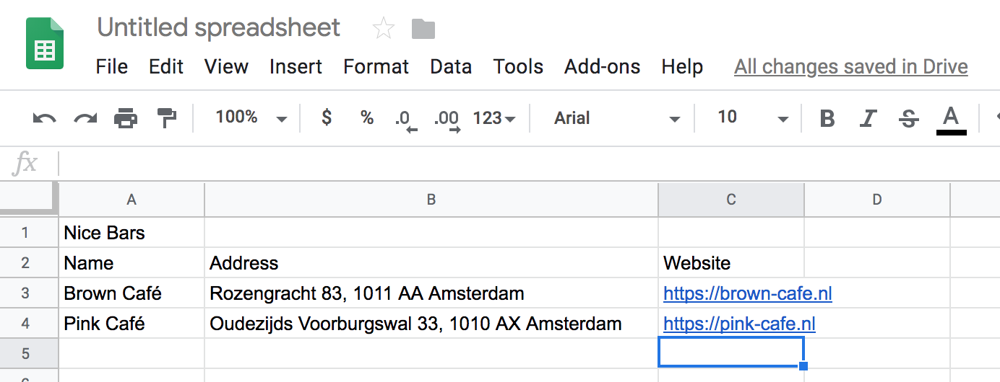

# Google Sheets to Maps
## Introduction
In order to visualize a data set of addresses from Google Sheets on a map I've created this repository. The idea was to have a little app which automatically grabs a CSV version of a Google Sheets document, parses the addresses and then finds geocoded coordinates for these addresses so we can add markers to a maps.

Unfortunately the Google API has been closed a bit more so a lot of access is unavailable without setting up proper billing information. To get around this problem, I decided to use the TomTom Maps API instead for the geocoding, and use the Leaflet.JS library to add the markers to the map.

## Getting started
In order to get started you first need to set up the following things:
- [TomTom API key](https://developer.tomtom.com/user/login?destination=user/me/apps)
- [Mapbox Access Token](https://www.mapbox.com/studio/account/tokens/)
- [Get CSV link for Google Sheets document](
https://help.aftership.com/hc/en-us/articles/115008490908-CSV-Auto-Fetch-using-Google-Drive-Spreadsheet)

I've configured the Google sheets document to have the title on the first line of the sheet, the second line should have all the headers for the CSV file which will be used to identify the values in the sheet.

TomTom Maps API will work more accurately if you provide it with some starting Latitude and Longitude as well a country, so try and find these for the city you're creating a map for.

Example sheet:

## Installation
- Download the repository from GitHub
- Run `npm install` or `yarn` in the folder to install the dependencies
- Copy `.env.example` to `.env`
- Fill in the variables in the newly created `.env` file.

## Links
Getting a CSV link for Google Sheets:
https://help.aftership.com/hc/en-us/articles/115008490908-CSV-Auto-Fetch-using-Google-Drive-Spreadsheet

Leaflet.JS:
https://leafletjs.com/